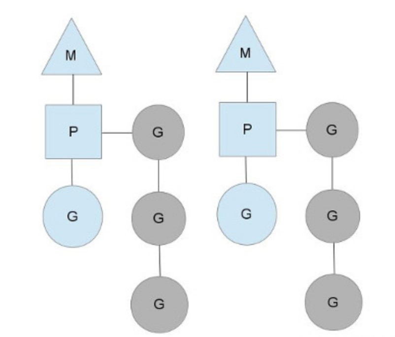
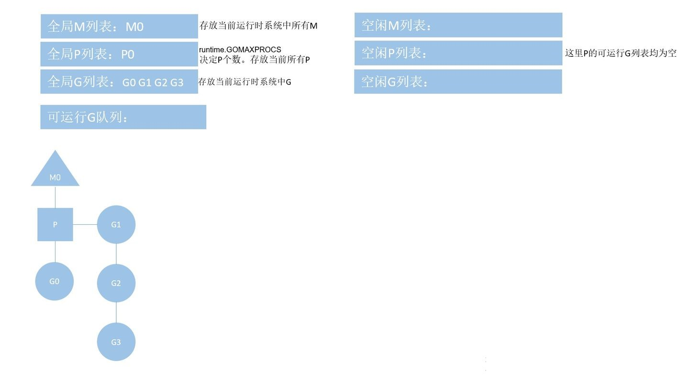
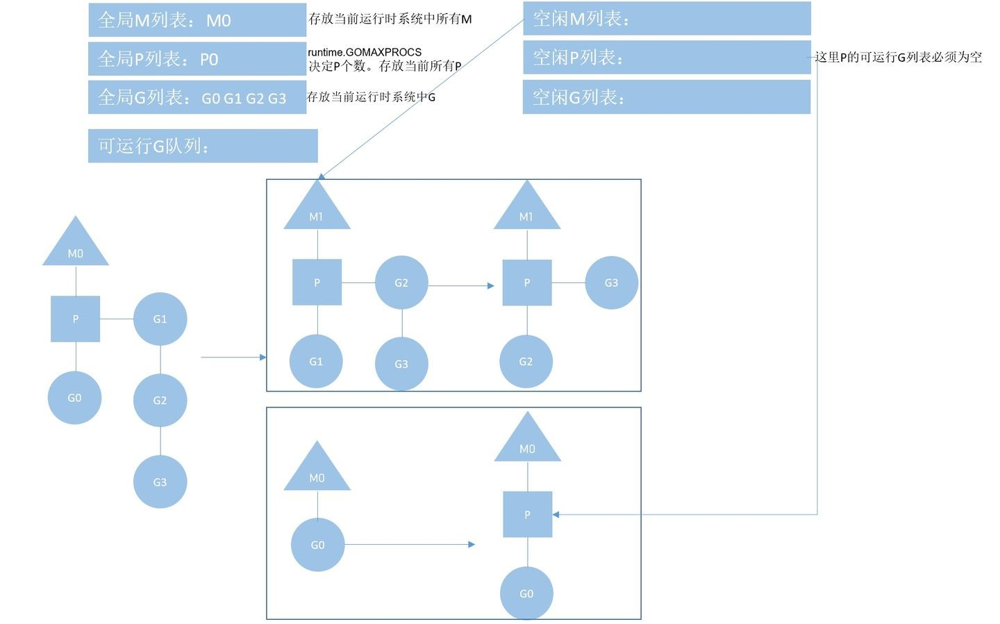
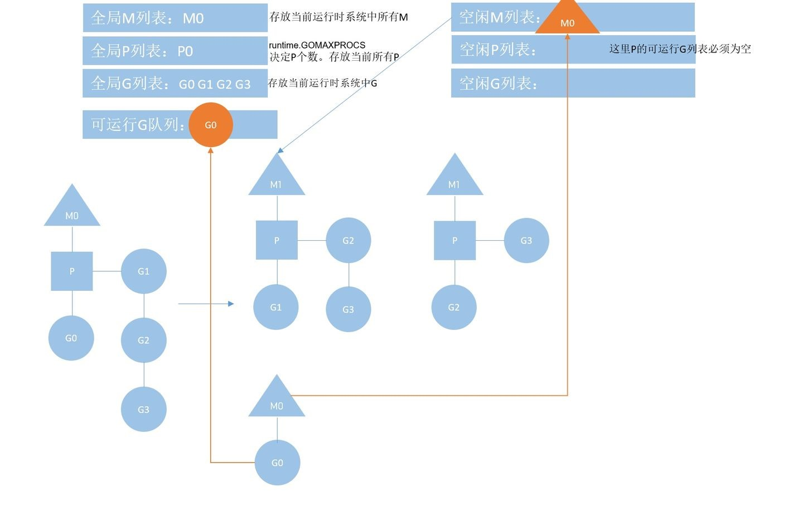

# go语言并发之MPG模型

Go 被认为是一门高性能并发语言，得益于它在原生态支持**协程并发**。

>请记住go并发的真理：
Do not communicate by sharing memory; instead， share memory by communicating.
不要以共享内存的方式来通信，相反，要通过通信来共享内存。

这里我们首先了解**进程**、**线程**和**协程**这三者的联系和区别。

在多道程序系统中，**进程**是一个具有独立功能的程序关于某个数据集合的一次动态执行过程，是操作系统进行资源分配和调度的基本单位，是应用程序运行的载体。

而**线程**则是程序执行过程中一个单一的顺序控制流程，是 CPU 调度和分派的基本单位。**线程是比进程更小的独立运行基本单位**，一个进程中可以拥有一个或者以上的线程，这些线程共享进程所持有的资源，在 CPU 中被调度执行，共同完成进程的执行任务。

在 Linux 系统中，根据资源访问权限的不同，操作系统会把内存空间分为内核空间和用户空间：内核空间的代码能够直接访问计算机的底层资源，如 CPU 资源、I/O 资源等，为用户空间的代码提供计算机底层资源访问能力；用户空间为上层应用程序的活动空间，无法直接访问计算机底层资源，需要借助“系统调用”“库函数”等方式调用内核空间提供的资源。

同样，线程也可以分为内核线程和用户线程。**内核线程**由操作系统管理和调度，是内核调度实体，它能够直接操作计算机底层资源，可以充分利用 CPU 多核并行计算的优势，但是线程切换时需要 CPU 切换到内核态，存在一定的开销，可创建的线程数量也受到操作系统的限制。**用户线程**由用户空间的代码创建、管理和调度，无法被操作系统感知。用户线程的数据保存在用户空间中，切换时无须切换到内核态，切换开销小且高效，可创建的线程数量理论上只与内存大小相关。

**协程是一种用户线程，属于轻量级线程**。协程的调度，完全由用户空间的代码控制；协程拥有自己的寄存器上下文和栈，并存储在用户空间；**协程切换时无须切换到内核态访问内核空间，切换速度极快**。但这也给开发人员带来较大的技术挑战：开发人员需要在用户空间处理协程切换时上下文信息的保存和恢复、栈空间大小的管理等问题。


# MPG内存调度模型：


1. **M** 代表着一个内核线程，也可以称为一个工作线程。goroutine就是跑在M之上的。M的数量，一般略多于P，SetMaxThreads参数设置上线为10000个，但是由于核数的限制，根本到不了这个限制。

2. **P** 代表着(Processor)处理器，将等待执行的G与M对接。 它也维护了一个可运行的goroutine队列，和自由的goroutine队列，里面存储了所有需要它来执行的goroutine。P的数量，由系统变量 GOMAXPROCS控制的，一般为cup 的核数。

3. **G** 代表着goroutine 实际的数据结构(就是你封装的那个方法)，并维护着goroutine 需要的栈、程序计数器以及它所在的M等信息。

**MPG**调度器只关注单独的Go程序中的Goroutine，如下图的**G0**。Go Goroutine采用的是半抢占式的协作调度，只有在 **G0** 发生阻塞时才会导致调度，否则会依次执行 **P** 绑定的其他 **G**；



当前 **P** 绑定着一个内核线程 **M0** ，正在执行协程 **G0**，其维护列表中还有协程 **G1**，**G2**，**G3**。

如果这个时候，**G0 **如果因为需要磁盘读写而**阻塞**，调度器会将 **P** 与当前的 **M0** 和 **G0** 解绑，同时去空闲 **M列表**中找新的 **M**，如果没有则创建 **M1**，绑定 **P**，顺序执行 **P
**下的 **G1**，其中 **G2**， **G3 **仍然在 **P **的等待列表中。

如下图所示：




当 **G0** 阻塞结束后，调度器会到空闲P列表中为 **M0**找空闲可绑定的**P**，如果恰巧有**P**，则继续执行 **G0**。如果没有可用的 **P**，**M0 **被放入空闲列表，等待调度给需要的 **G**；**G0 **被放入可运行的 **G** 列表，列表中的 **G** 会经由调度再次放入某个 **P** 的可运行 **G** 队列。如下图所示：




至此一个简单的**MPG流程**就完成了。

# 补充说明：
调度器的设计策略：
```
复用线程：
避免繁琐的创建，销毁线程。

Work stealing 机制：
本线程 M 无可运行的G时，尝试从其他 M 绑定的 P 里偷协程，而不是销毁。

Hand off 机制：
本线程因为 G 进行系统调度而阻塞的时候，释放绑定的 P，把 P 移交给其他空闲的 M

利用并行：
GOMAXPROCS 设置 P 的数量，最多有 GOMAXPROCS 个线程分布在多个 CPU 上同时运行。GOMAXPROCS 也限制了并发的程度，比如 GOMAXPROCS = 核数/2，则最多利用了一半的 CPU 核进行并行。

抢占：
G 占用Cpu的时候只会占用10ms，然后让出cup，防止其他 G 饿死。

全局GQ：
当 P 队列满时，新生成的 G 会在全局队列中存放，当 M 在其他 P 中偷取不到G时候会从 GQ 里获取。
```
M0：
```
M0 是启动程序后的编号为 0 的主线程，这个 M 对应的实例会在全局变量 runtime.m0 中，不需要在 heap 上分配，M0 负责执行初始化操作和启动第一个 G， 在之后 M0 就和其他的 M 一样了。
```
G0：
```
G0 是每次启动一个 M 都会第一个创建的 goroutine，G0 仅用于负责调度的 G，G0 不指向任何可执行的函数，每个 M 都会有一个自己的 G0。在调度或系统调用时会使用 G0 的栈空间，全局变量的 G0 是 M0 的 G0。
```