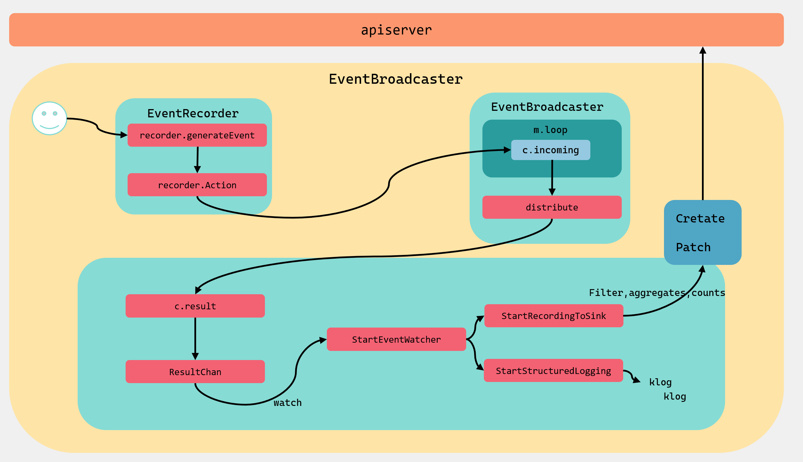
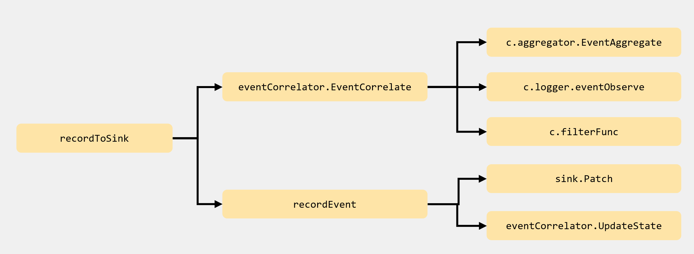

1.首先是初始化 EventBroadcaster 对象，同时会初始化一个 Broadcaster 对象，并开启一个 loop 循环接收所有的 events 并进行广播；
2.然后通过 EventBroadcaster 对象的 NewRecorder () 方法初始化 EventRecorder 对象，EventRecorder 对象会生成 events 并通过 Action () 方法发送 events 到 Broadcaster 的 channel 队列中；
3.EventBroadcaster 会调用 StartStructuredLogging、StartRecordingToSink 方法调用封装好的 StartEventWatcher 方法，并执行自己的逻辑；
4.StartRecordingToSink 封装的 StartEventWatcher 方法里面会将所有的 events 广播给每一个 watcher，并调用 recordToSink 方法对收到 events 后会进行缓存、过滤、聚合而后发送到 apiserver，apiserver 会将 events 保存到 etcd 中。

