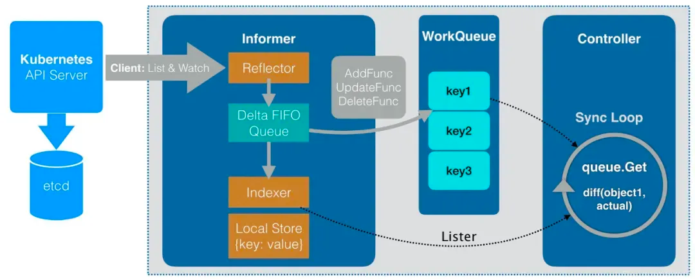

# kubernetes声明式API的实现方式

本篇文章主要通过部分代码示例及相应步骤解析来介绍kubernetes中声明式API的一种实现方式及原理。

## 声明式API及命令式API

声明式API是一种比命令式API更高级的接口设计方式，简单来说，命令式API提供给用户怎么做的能力，而声明式API给用户提供了做什么的能力，以下用炒菜为例解简单的诠释两者区别。

命令式API：炒菜机炒菜，我告诉它放油、放调料、放食材、大火、小火。

声明式API：炒菜机炒菜，我告诉要一盘炒螺丝。

## 实现方式（crd+controller）

### CRD

从 Kubernetes 的用户角度来看，所有东西都叫资源 Resource，CRD 全称是 Custom Resource Definition，CRD 本身是 Kubernetes 的一种资源，表示自定义资源的定义。主要包含（spec，status）

#### spec

资源的期望状态，用来标示资源当前期望到达什么状态（即你想要什么）。

#### status

资源当前状态汇总，用来标示资源当前是什么情况 主要包含（phase，condition）

##### phase

当前资源实际状态，用来标示当前资源状态。

##### condition

##### 为什么有了 phase，为什么还要有 conditions

因为 status中的 phase 比较简单的描述了 资源 处于哪个具体情况，但是没有明确说明具体原因。

##### 作用

用于描述资源当前是否处于哪个phase，以及处于该 phase 的原因，作为一个辅助手段，详细的展示资源的状态信息，用于问题排查分析时提供更多依据。同一时间，一个资源可能处于多个conditions

##### 示例

```
apiVersion: app.orcastack.io/v1beta1
kind: OrcaApp
metadata:
  name: mysql-operator-7849679bbf-b97kr
  namespace: orca-components
status:
  phase: Running
  conditions:
    - type: Initialized
      status: 'True'
      lastProbeTime: null
      lastTransitionTime: '2023-02-28T06:51:32Z'
    - type: Ready
      status: 'True'
      lastProbeTime: null
      lastTransitionTime: '2023-02-28T06:51:47Z'
    - type: AppScheduled
      status: 'True'
      lastProbeTime: null
      lastTransitionTime: '2023-02-28T06:51:32Z'
spec:
  containers:
    - name: mysql-operator
      image: repo.hundsun.com/xx/xxs/operator:xx-xx
      ports:
        - name: webhook-server
          containerPort: 9443
          protocol: TCP
      terminationMessagePath: /dev/termination-log
      terminationMessagePolicy: File
      imagePullPolicy: IfNotPresent
```

该示例是一个自定义资源OrcaApp对象，我只取了相对比较简略的部分。

从该对象中的spec我们可以看出该OrcaApp对象期望可以创建出一个containers，其containers的期望image是repo.hundsun.com/xx/xxs/operator:xx-xx等等

从对象的status中我们可以看出该OrcaApp现在已经处于running状态，且condition中记录它起码经过了3次调协，分别是Initialized，Ready，AppScheduled，且每次执行都是成功的。

### 控制器

#### controller

```
func (r *RunReconciler) Reconcile(ctx context.Context, req ctrl.Request) (ctrl.Result, error) {
	instance := &v1.OrcaApp{}
	err := r.Client.Get(ctx, req.NamespacedName, instance)
	if err != nil {
		// 处理获取对象失败时的场景
	}
	
	//获取需要执行的方法
	// 遍历执行方法
	// 获取执行方法结果
	// 结果1： 继续执行后续方法 结果2：return且重新入队列 结果3：return且不重新入队列
	/*
	...
	*/
	
	
    //执行完所有方法的话 需要停止协调。
	return &ctrl.Result{
		Requeue:      false,
		RequeueAfter: 0,
	}
}
```

控制器对于处于队列中对象，会进行相对应的逻辑处理，根据其逻辑处理结果决定该对象是否重新入队列。

#### Result

```
type Result struct {
    //是否需要重入队列
    Requeue bool

	//延迟重入队列的时间
	RequeueAfter time.Duration
}

```

处理完逻辑后，需要返回结果，只有没有到达处理的前置条件时，requeue才是true（需要重新入队列）。

如果你逻辑处理成功并且更新了对象中的phase及condition，对象的变动会导致对象变动重新入队列，所以requeue返回false即可。

### 原理及步骤解析

控制器的原理及流程图如下：


利用Informer的List & Watch机制，监听了该自定义资源对象的变化。一旦资源发生变动，就会将对象加入队列WorkQueue中，利用controller来处理对象。

针对上述举例的OrcaApp的spec及status中其协调程部署如下:

步骤一：**OrcaApp**对象变动（**用户创建**），入workQueue队列,此时对象spec及status详细如下：

```
status:
spec:
  containers:
    - name: mysql-operator
      image: repo.hundsun.com/xx/xxs/operator:xx-xx
```

步骤二：获取对象，获取执行方法（Initialized，Ready，AppScheduled）；

步骤三：执行**Initialized**方法成功，记录condition及phase并且更新**OrcaApp**对象，return，要求不重新入队列，此时对象spec及status详细如下：

```
status:
  phase: Pending
  conditions:
    - type: Initialized
      status: 'True'
      lastProbeTime: null
      lastTransitionTime: '2023-02-28T06:51:32Z'
spec:
  containers:
    - name: mysql-operator
      image: repo.hundsun.com/xx/xxs/operator:xx-xx
```

步骤四：**OrcaApp**对象变动（（**步骤三**程序更新对象导致），入workQueue队列；

步骤五：获取对象，获取执行方法（Initialized，Ready，AppScheduled）；

步骤六：执行当前spec对应的Initialized，发现已经执行过了，**跳过**，执行**Ready**方法成功，记录condition及phase并且更新**OrcaApp**对象，return，要求不重新入队列，此时对象spec及status详细如下：

```
status:
  phase: Pending
  conditions:
    - type: Initialized
      status: 'True'
      lastProbeTime: null
      lastTransitionTime: '2023-02-28T06:51:32Z'
    - type: Ready
      status: 'True'
      lastProbeTime: null
      lastTransitionTime: '2023-02-28T06:51:47Z'
spec:
  containers:
    - name: mysql-operator
      image: repo.hundsun.com/xx/xxs/operator:xx-xx
```

步骤七：**OrcaApp**对象变动（**步骤六**程序更新对象导致），入workQueue队列；

步骤八：获取对象，获取执行方法（Initialized，Ready，AppScheduled）；

步骤九：执行当前spec对应的Initialized，发现已经执行过了，**跳过**，执行当前spec对应的Ready方法，发现已经执行过了，**继续跳过**，执行**AppScheduled**方法成功，记录condition及phase并且更新**OrcaApp**对象，return，要求不重新入队列，此时对象spec及status详细如下：

```
status:
  phase: Running
  conditions:
    - type: Initialized
      status: 'True'
      lastProbeTime: null
      lastTransitionTime: '2023-02-28T06:51:32Z'
    - type: Ready
      status: 'True'
      lastProbeTime: null
      lastTransitionTime: '2023-02-28T06:51:47Z'
    - type: AppScheduled
      status: 'True'
      lastProbeTime: null
      lastTransitionTime: '2023-02-28T06:51:32Z'
spec:
  containers:
    - name: mysql-operator
      image: repo.hundsun.com/xx/xxs/operator:xx-xx
```

步骤十：**OrcaApp**对象变动（**步骤九**程序更新对象导致），入workQueue队列；

步骤十一：获取对象，获取执行方法（Initialized，Ready，AppScheduled）；

步骤十二：发现当前spec对应的方法**全部执行完成**，return且要求不重新进入队列；

步骤十三：协调结束。

在以上步骤中，即便用户中途修改了**spec**部分，结果就是**重新进入队列**协调继续执行对应方法，所以对于**operator模式**来说，协调过程中，OrcaApp对象是可以**随时变化**的。

以上便是基于kubernetes实现的一套完整的**声明式API** 实现方式。

### 总结

所谓**“声明式API”**，指的就是我只需要提交一个定义好的API对象来**声明**我所**期望的状态**是什么样子。**声明式API**才是 Kubernetes 项目编排能力“赖以生存”的核心所在。

上述的这套流程，不仅可以用在**自定义API资源**上，也完全可以用在Kubernetes原生的**默认API对象**上,我们可以通过对**自定义API对象**和**默认API对象**进行协同,从而实现更加复杂的**编排功能**

关注资源的**“实际状态”**，然后去跟**“期望状态”**做对比,从而决定接下来要做的业务逻辑，这就是Kubernetes **API编程范式**的核心思想。

